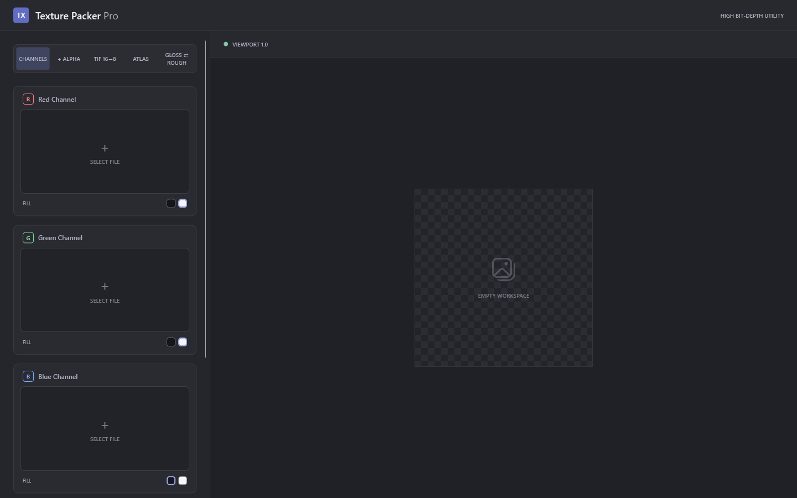

# Texture Packer

A local texture utility in two maintained versions: a native C# Windows app with Microsoft's Fluent design, and a browser app with the same five operations. Free to use, modify and redistribute under the MIT license.

Both versions preserve the original Texture Packer layout: top header, horizontal mode tabs inside the 380px source panel, large 2:1 texture wells and the viewport on the right. The Windows app uses Microsoft's native Mica backdrop with translucent content layers; the web app uses matching Fluent surfaces. The five-mode layout is checked against the original at 1360×840 and 1440×900.

[Open the web app](https://so2k.github.io/TexturePacker/) · [Download for Windows x64](https://github.com/So2K/TexturePacker/releases/latest/download/TexturePacker-win-x64.zip)



## Operations

| Operation | Behavior in both versions |
| --- | --- |
| Channel packing | Assign maps to R, G, B and A. Empty inputs use black or white. Scalar inputs use the source red component. |
| Combine alpha | Preserve the base texture's RGB and replace alpha with the mask's red component. |
| TIFF 16 → 8 | Convert the first TIFF frame into a lossless 8-bit RGBA PNG, without automatic contrast normalization. |
| Texture atlas | Place images in a grid up to 20 × 20. Empty tiles are opaque black; cell size comes from the first populated input. |
| Invert map | Invert selected R/G/B/A channels, with gloss/roughness, normal Y, alpha and all-channel presets. |

Both versions import PNG, JPEG, TIFF, BMP, TGA and WebP and export PNG. Processing stays on your computer. There are no accounts, API keys or image uploads. Selecting another mode keeps its source inputs; changing inputs or settings invalidates the previous output.

Packing chooses the smallest source width and height independently. Alpha composition uses the base texture's dimensions when supplied. Other inputs are resized to the operation's dimensions. TIFF conversion uses ImageMagick's standard 8-bit quantization without automatic contrast normalization. PNG operations preserve RGB values hidden beneath zero alpha.

Images are limited to 16,384 pixels per side, 67,108,864 total pixels and 512 MiB per input file. Available device memory can impose lower practical limits. JPEG/WebP decoding and image resampling may differ slightly between the browser and ImageMagick; deterministic same-size operations are checked with shared pixel fixtures.

## Run

**Windows:** extract the release ZIP and run `TexturePacker.exe`. It includes .NET and the image library. Windows x64 is supported. The executable is unsigned. Use Ctrl+O to add textures, Ctrl+Enter to process, and Ctrl+S to export.

**Web:** open the site in a modern browser. It is a static GitHub Pages site; all dependencies are bundled locally. The download link opens the current Windows release.

## Develop

Install .NET SDK 10 and Node.js 22 or later. On Windows:

```powershell
dotnet build TexturePacker.sln -c Release
dotnet run --project src/TexturePacker.Desktop -r win-x64 --self-contained true
dotnet run --project tests/TexturePacker.Core.Tests -c Release
dotnet run --project tests/TexturePacker.Desktop.Tests -c Release -r win-x64 --self-contained true
./scripts/Publish-Windows.ps1
```

For the web app:

```sh
cd web
npm ci
npm run dev
npm run lint
npm run build
npx playwright install chromium
npm test
npm run test:production
```

The native engine lives in `src/TexturePacker.Core`, the WPF interface in `src/TexturePacker.Desktop`, and the browser version in `web`. Shared fixtures live in `tests/fixtures`. Keep operation changes and their regression checks synchronized across both implementations.

`standalone` is the main development/default branch. `typescript-legacy` preserves the original web prototype. GitHub Actions validates both versions, deploys web changes to Pages, and publishes Windows downloads for `v*` tags. The web Pages build uses `/TexturePacker/` as its asset base.

## License

MIT, copyright © 2026 So2K. Third-party packages retain their own licenses; notices are included with the site and Windows download. See [THIRD-PARTY-NOTICES.md](THIRD-PARTY-NOTICES.md).
